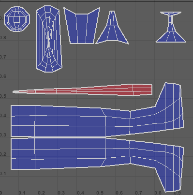
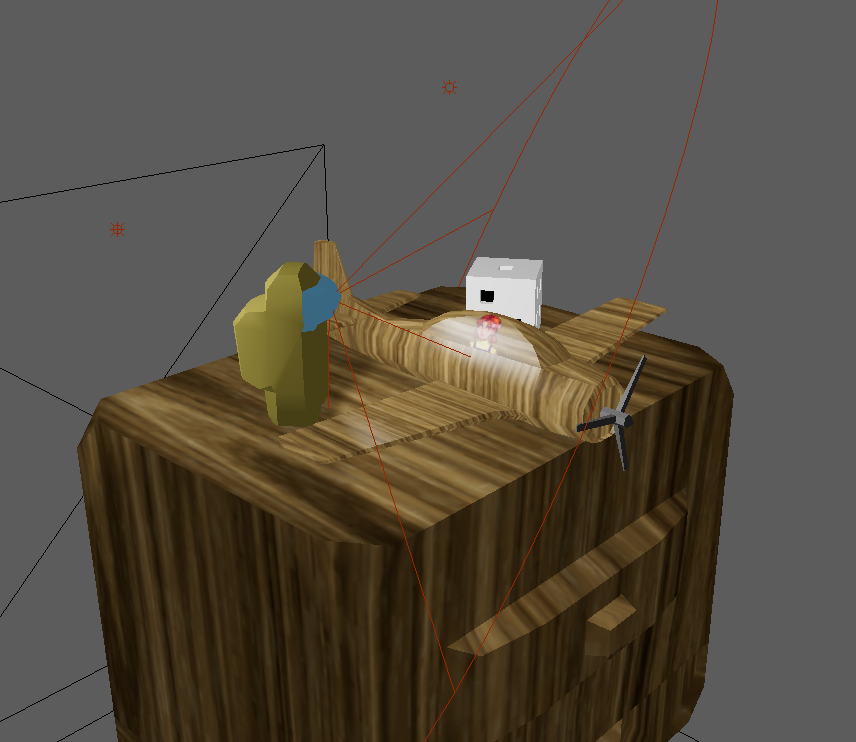
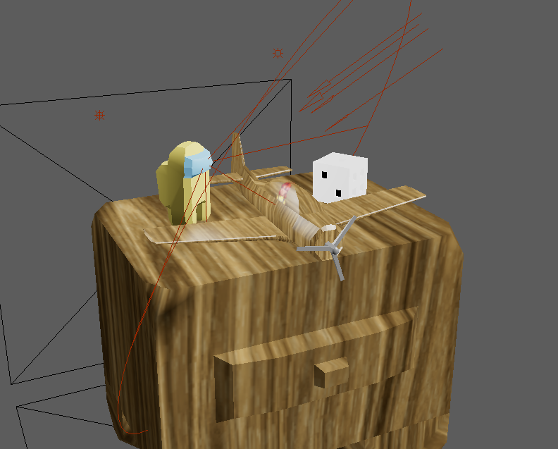

Chris Culling

Lab report for **Mod-L2**

28 Nov 2024

---

I was following along the [demo](https://play.mau.se/media/t/0_7637k20c) and started UV mapping.

1. Create UV Planar
2. 3D Cut and Sow
    - Separated nose and cockpit from the rest of the body
3. Unfold UV Shells and Reduce Distortions
    - Unfolded the cockpit
    - Created new planar UV for the nose from the Z-axis before using **Optimize**
4. Apply materials/textures after making use of UV map masks

Because I started with a cylinder for the plane model, I didn't end up with a line separating the plane down the middle, so I had to split both top and bottom as well as each side into different UV shells.

Note that the wings and propeller are separate objects.

I added a die and an Amongus character. The plane uses a modified version of the wood texture, adding a character sprite in the cock-pit (Singe material with texture painting). The other items use either a single material or multiple materials per object.

### Light Setting #1

### Light Setting #2

This one adds a directional light, representing the sunshine through a nearby window.

