Chris Culling

Lab report for **Mod-L3**

17 Dec 2024

---

# Diffuse Color Baking

## The cubes

I started by making a cube with one material/texture per side as per the instructions:

> Bake diffuse textures for two models in two separate scenes:
>
> 1. **A simple object,** such as a cube.
> 2. A **more complex** object from L1 or L2, such as the Trojan airplane.
>
> The source objects should have at least a handful of different materials and textures. One per face when it comes to a cube, for example.

I suffered for way too long because Maya has this button that toggles the viewing of textures and I did not realise why my textures were not showing this program sucks please replace it with Blender

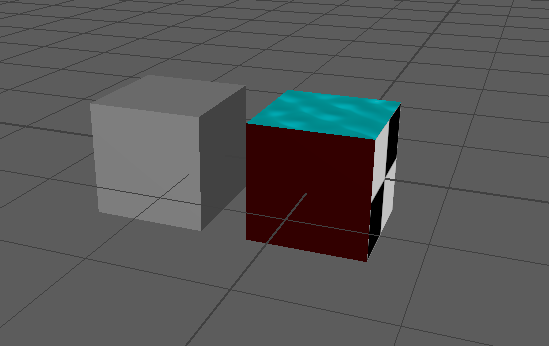

When I tried to bake, it didn't work despite copying the settings in the demo on canvas. I suspect it may have to do with having applied materials and textures to the *faces* instead of the UV-shells.

Correction: It did not automatically apply the generated PNG as a texture onto the destination cube. I noticed also that two of the sides did not come out right in the PNG, presumably because they made use of shaders that don't translate into PNG format.

Manually setting the destination cube's texture to the newly generated cubeDiffuse.png worked perfectly fine otherwise.

I followed the [demo](https://play.mau.se/media/t/0_c46ugan0) and its settings.

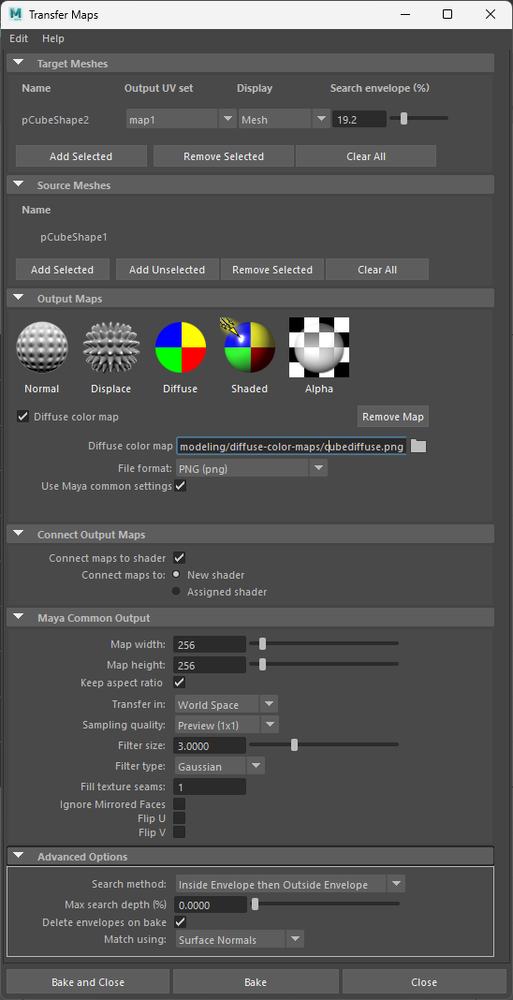

Still, for some reason when baking, the target cube has way darker materials and textures to the point that you can't see what some sides are supposed to resemble.

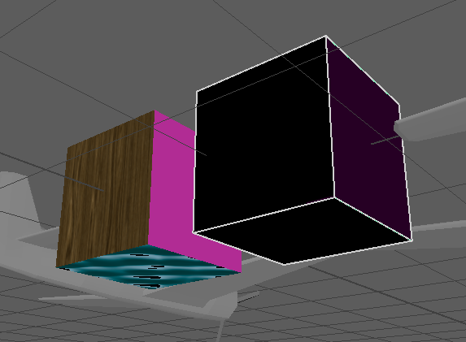

Changing `Transfer in:` to `Object Space` instead of `World Space` fixed it, although some of the target cube's sides are still a smidge darker. *The settings were not identical!* The following screenshot shows the successful settings:

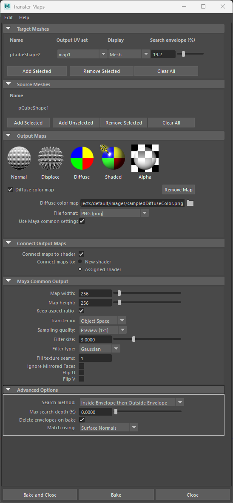

The result:

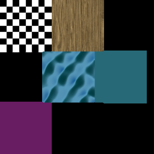

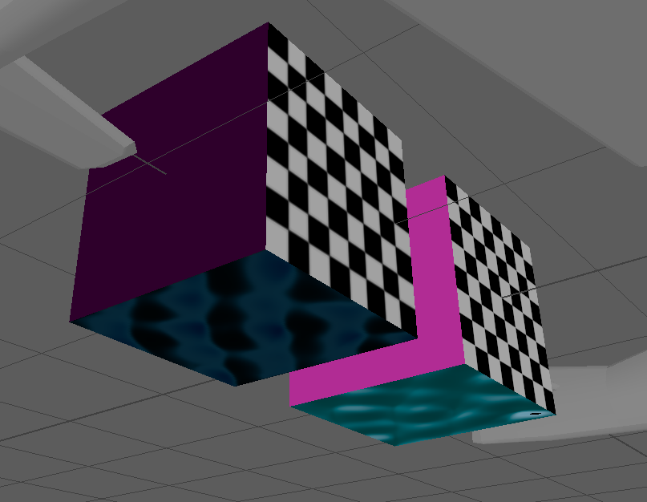

## The Plane

I then applied different textures and materials to the different parts of my plane:

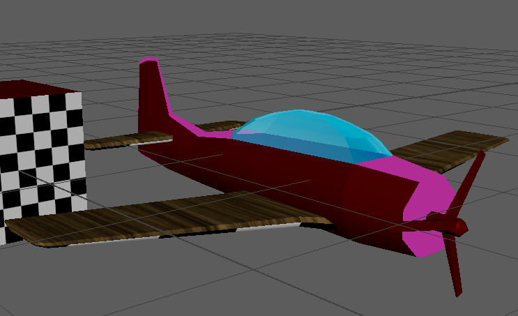

### The Failure

Then with the following settings (after combining all the plane parts into one mesh -> `Mesh/Combine`), I baked the plane

Only applied to the wings. Did I combine the meshes incorrectly or am I overlooking something?

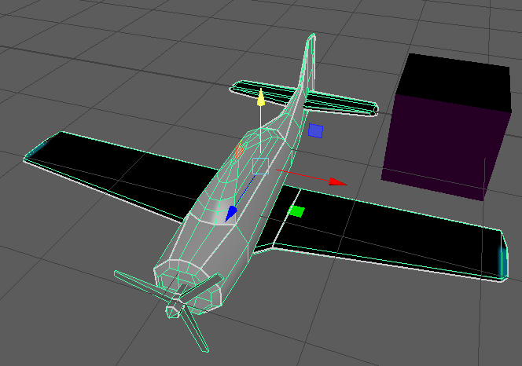

When I undid the mesh combination and tried to bake diffuse the separate meshes all at once, it came out all scrambled:

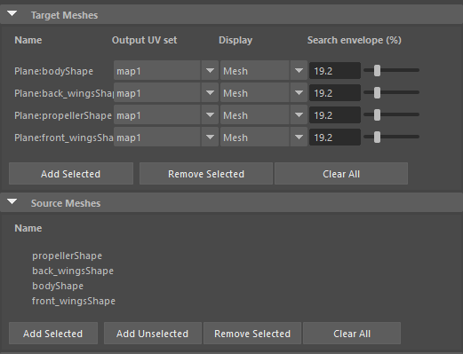

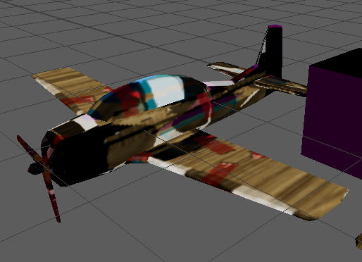

So, next up I decided to diffuse bake the different meshes individually, which worked perfectly fine until I tried to bake the front wings, which mysteriously also applied to the back wings and vice versa, as if they were part of the same object/mesh! They are inexplicably linked. I suspect relates to the issue I had earlier with the bake only applying textures onto the wings (incorrectly).

*For some reason, when changing the layer structure of things, the diffuse bake becomes weird and messed up on the plane body.* Update: Presumably because I forgot to change the name of the diffuse result png and that caused them to refresh.

### Solution

After a while of googling and rummaging around in Hypershade and more, I realised that `lambert1` was being edited and that they both were assigned `lambert1` presumably by default. **The pngs that were generated by diffuse bake, however, were perfectly fine.** As a solution, I created two new lambert materials and and assigned them to the files generated by the bake. Then, both wings displayed their textures correctly. Still, the metallic surfaces were still quite dark, presumably because on the source mesh, the darkness varies on viewing angle, and that it baked the material based on a viewing angle where it simply *was* dark. I tried using `Shaded Diffuse` and tinkering with the different resolutions and settings, but the color did not get brighter. I would probably have to edit the material.

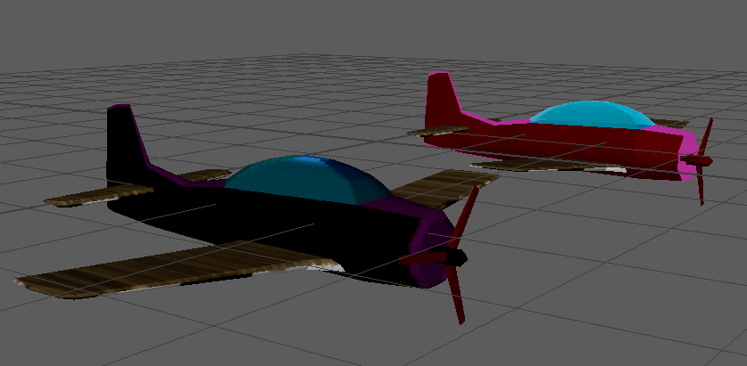

# Normal map baking

*Under construction...*