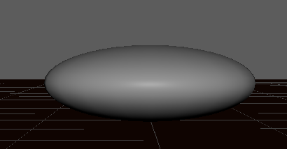

Chris Illy Culling

Lab report for **Mod-L4**

31 Mar 2025

---

# 1. Bouncing Ball

- Brown floor
- Sphere object 

I got familiar with the `Animation View` and the `Graph Editor` and learned how to add keyframes. In order to make the ball look like it's bouncing, I keyframed its starting position (airborne) alongside its regular Y-axis scale (`1`). I then added keyframes in the center of the timeline for its most squished-together state, which I call the "patty".

- `Translate Y: 0.25`
- `Scale Y: 0.25`

However, since I only want it to start squishing after initial impact, I needed to define a point on the timeline where the impact *starts* rather than when it's in its turning point. For simplicity's sake, I've made the motion of the bouncing ball symmetrical before and after the patty.

In order to keep the ball from clipping through the plane, I needed to make sure that the `Translate Y` and `Scale Y` stay identical for the duration of impact (whenever the `Translate Y < 1`). I accomplished this by **breaking the tangents** of the keyframes representing point of impact and lining up the `Scale Y` curve with the `Translate Y` curve.

In order to make the motion more natural, I added an extra frame of the patty state and increased the rate of travel slightly nearer the patty state. The result was pretty good. Below is each frame from impact to patty alongside the final Graph Editor graph.

<!--  -->

# 2. Manual Rigging and Skinning

*Import rig, and skin a humanoid mesh.*

I started by creating joints in the core of the model leading up to the neck and head before appending joints for the limbs on it's left side.

Then I oriented the joints *to world*.

Then I went ahead and named my joints.

Only then did I mirror my joints to match on the other side.

# 3. Auto-Rigging and Skeletal Animation

